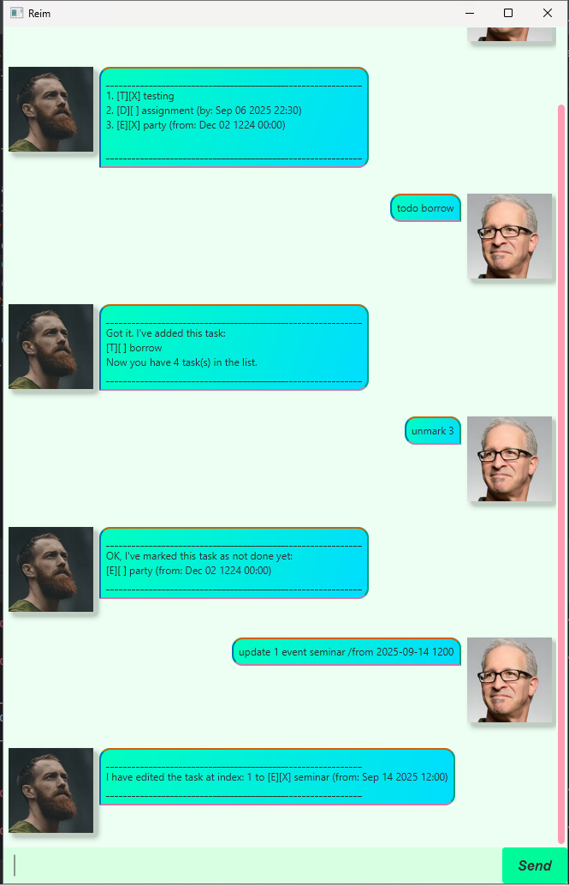

# Reim User Guide
**A tasklist management system for your daily needs**



## Features

### Adding todos
Add a todo task that you have to manage to never forget about

Example: `todo borrow books`

A description of the task you just added and saved to your tasklist will be shown

```
____________________________________________________________
Got it. I've added this task:
[T][ ] borrow books
Now you have 1 task(s) in the list.
____________________________________________________________
```

### Adding deadlines
Add a deadline task that you have to manage to never forget about


Example: `deadline assignment /by 2025-09-19 2359`

A description of the task you just added and saved to your tasklist will be shown

```
____________________________________________________________
Got it. I've added this task:
[D][ ] assignment (by: Sep 19 2025 23:59)
Now you have 2 task(s) in the list.
____________________________________________________________
```

### Adding events
Add a todo task that you have to manage to never forget about

Example: `event seminar /from 2025-09-14 1200`

A description of the task you just added and saved to your tasklist will be shown

```
____________________________________________________________
Got it. I've added this task:
[E][ ] seminar (from: Sep 14 2025 12:00)
Now you have 3 task(s) in the list.
____________________________________________________________
```

### Marking your tasks as done
Mark a task as done once you have completed them

Example: `mark 2`

A message telling you which task you have marked as completed will be shown

```
____________________________________________________________
Nice! I've marked this task as done:
[D][X] assignment (by: Sep 19 2025 23:59)
____________________________________________________________
```

### Marking your tasks as not done
Mark a task as not done if you realised that it has not been completed

Example: `unmark 2`

A message telling you which task you have marked as not done will be shown

```
____________________________________________________________
OK, I've marked this task as not done yet:
[D][ ] assignment (by: Sep 19 2025 23:59)
____________________________________________________________
```

### Deleting tasks
Delete a task that is no longer relevant or needed

Example: `delete 3`

A message telling you which task you have deleted will be shown

```
____________________________________________________________
Noted, I've removed this task:
[E][ ] seminar (from: Sep 14 2025 12:00)
Now you have 2 task(s) in the list
____________________________________________________________
```

### Finding tasks
Find a task within your tasklist by searching via task name

Example: `find borrow`

A list of the tasks that match your search criteria will be shown

```
____________________________________________________________
Here are the matching tasks in your list:
1. [T][ ] borrow
2. [T][ ] borrow books

____________________________________________________________
```

### Updating tasks
Update a task that you wish to change the details of

Example: `update 1 event party /from 2025-09-20 0000`

A message telling you that the task has been updated will be shown

```
____________________________________________________________
I have edited the task at index: 1 to [E][ ] party (from: Sep 20 2025 00:00)
____________________________________________________________
```

### Listing all tasks
List out all the tasks currently in the tasklist

Example: `list`

A list of all your tasks will be shown

```
____________________________________________________________
1. [E][ ] party (from: Sep 20 2025 00:00)
2. [D][ ] assignment (by: Sep 19 2025 23:59)
3. [T][ ] borrow books

____________________________________________________________
```

### Closing the application
Closes the application

Example: `bye`

```
____________________________________________________________
Bye. Hope to see you again soon!
____________________________________________________________
```
> You may not see this message in the GUI as the application will immediately close afterwards
